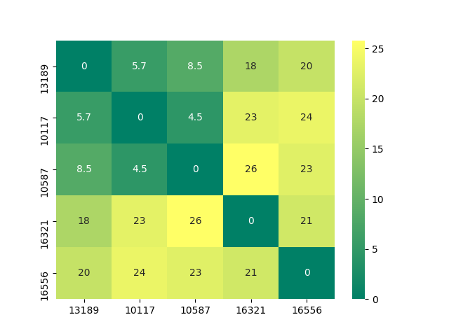

# geoDist

little helpers to calculate distance between locations using [haversine formula](https://en.wikipedia.org/wiki/Haversine_formula) for great-circle distances

### install dependencies

    pip install -r requirements.txt

### main functions

    geoDist(loc1, loc2)

returns the distance (in km) between two given locations (loc1, loc2) represented by geo coordinates (expressed as tuples of (longitude, latitude))

    geoDistZip(zip1, zip2)

returns the distance (in km) between two given locations (zip1, zip2) represented by ZIP codes (currently for germany only)

    geoDistZipDF(zips)

returns in a classical [distances matrix](https://en.wikipedia.org/wiki/Distance_matrix) codified in a [pandas DataFrame](https://pandas.pydata.org/pandas-docs/stable/reference/api/pandas.DataFrame.html) for multiple given locations represented as s list (zips) of valid german ZIP codes.

### helper function

    getCoord(zip)

returns geo coordinates to a given german zip code by using the *PLT.tab* file from [OpenGeoDB](http://opengeodb.org/wiki/OpenGeoDB_Downloads) to map the first to the latter

### usage standalone cli version

    python geoDist.py [option] [argument]

    option:
    -dm: calculates distance matrix if [argument] is a comma-separated list
    (!without whitespaces!) of valid german zip codes

    argument:
    a) two space-separated german zip-codes to calculate distance between them
    b) a comma-seperated list (!without whitespaces!) of valid german zip codes
    to calculate a distance matrix (only works if option "-dm" is set)

by *'uncommenting'* the last code block in *geoDistZipDF* a nice [heatmap](http://seaborn.pydata.org/generated/seaborn.heatmap.html) is plotted to visualize the distance matrix

